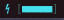

# batteryblocks
a dynamic battery level indicator for i3blocks

All ye who stumble accross this repo be warned that;
  at the time of writing,
    - I have done little more than cloning with git
    - I've never used markdown
... so bare with me for now.

* The script itself is good to go (still has some commented-out development/todo notes)
* The handful of "alternative modes" are just commented/uncommented for now.
* My goal is to use nothing more than bash-builtins, such that a fair amount of customization can be worked in without bloating it down.

# TO-DO:
  * Become better at math and flesh out custom baseColors palette input handling.
    + perhaps simplifying integration with other utilities, such as pywal.
  * currently seems to work fine with  4 <= ${#baseColors[@]} <= ?*
  * Make the exhibition .gif... better
  * notify-send at {9,6,3}%
  * set color of Bracket[{1,2}] according to whether battery is actually taking a charge or not.
